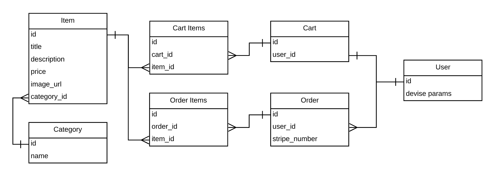

<h1>Coach Me Ecommerce 💻</h1>

Coach Me Ecommerce est une plateforme ecommerce pour acheter des articles de sport en quelques clics.

* Ruby version 2.5.1
* Rails version 5.2.3
* `bundle install`
* `rails db:create`
* `rails db:migrate`
* `rails db:seed`
* Pour le serveur avec stripe `PUBLISHABLE_KEY=pk_test_TYooMQauvdEDq54NiTphI7jx \`
  `SECRET_KEY=sk_test_4eC39HqLyjWDarjtT1zdp7dc rails s`
* en local : `http://localhost:3000/`
* en production : `https://coach-me-master.herokuapp.com/`

<h2>Architecture</h2>

--------

Fait par Maja, Guillaume, Nicolas, Rémi et Ladislas 🤙 en utilisant les ressources de [The Hacking Project](https://www.thehackingproject.org)
